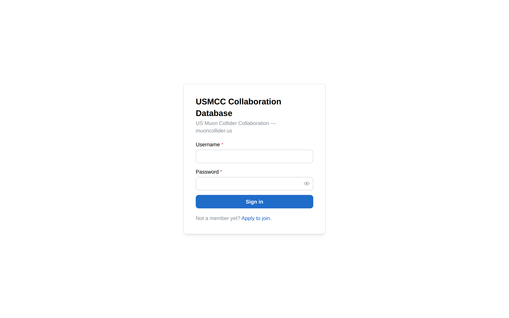
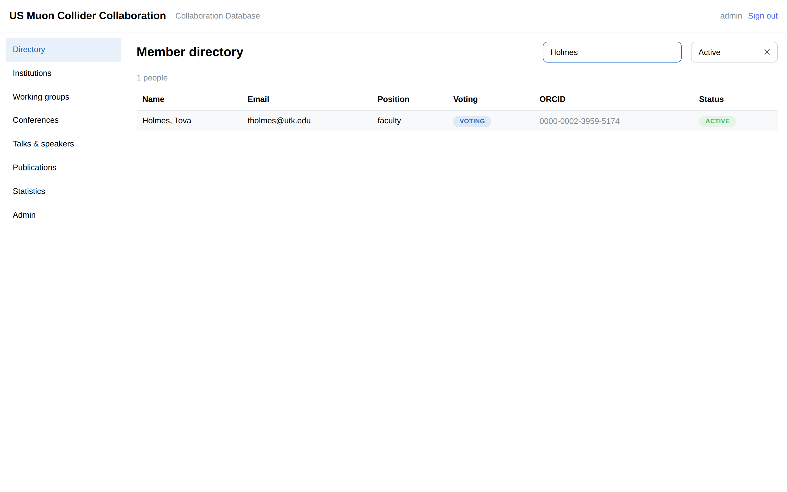
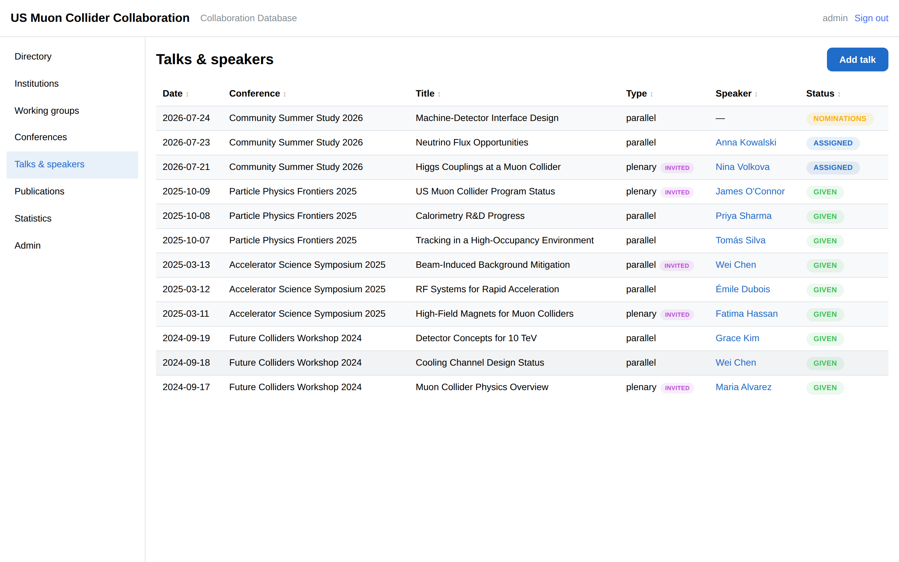
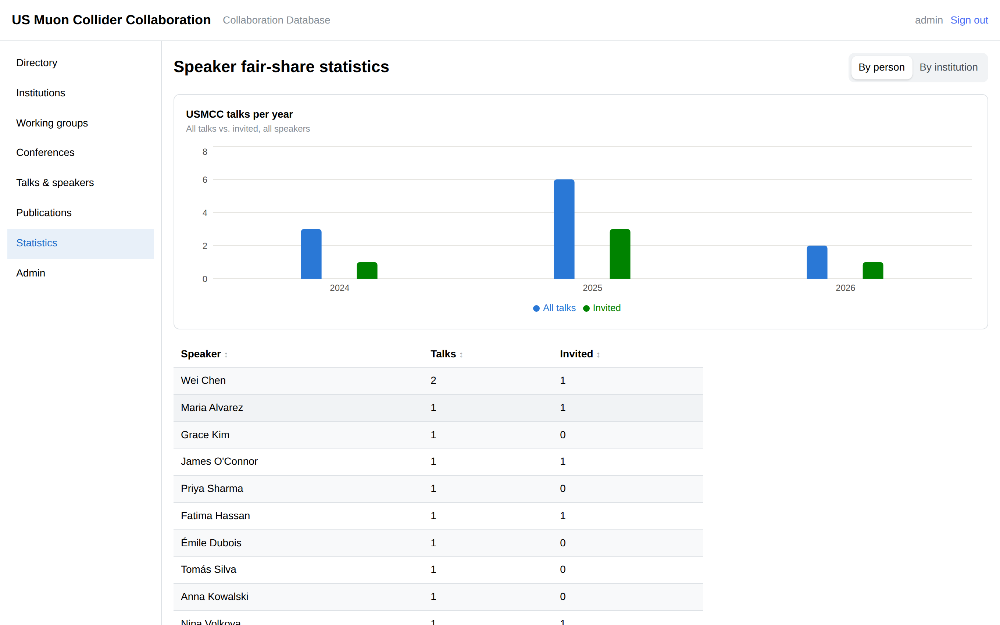
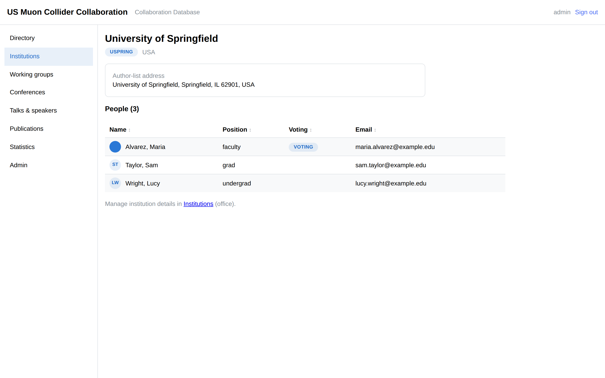
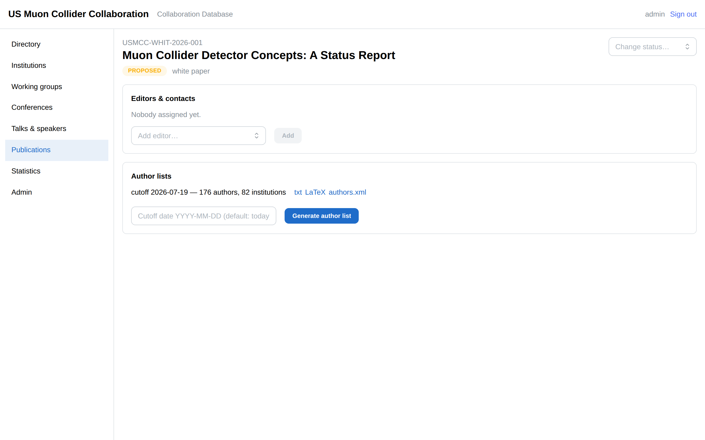

# USMCC Collaboration Database

[](https://github.com/trholmes/USMCCDB/actions/workflows/ci.yml)

The membership, speakers, and publications database of the
[US Muon Collider Collaboration](https://muoncollider.us) — inspired by the
[Glance/Fence](https://readthedocs.web.cern.ch/display/FP/Fence+Project) systems
used by the LHC experiments, built as a self-hosted open-source stack:
**FastAPI + PostgreSQL + React (Mantine)**, deployed with a single
`docker compose`, HTTPS via Caddy, nightly backups, and ORCID sign-in.

| | |
|---|---|
|  |  |
|  |  |
|  |  |

*(Screenshots show the bundled fictional demo dataset — `seed-demo`.)*

## What it does

- **Membership** — people, institutions, dated affiliations, voting-member flag,
  career stage, working groups, leadership roles, member photos, and an
  apply → approve workflow with a full audit trail.
- **Speakers bureau** — conferences, talk records (plenary/parallel/poster/
  seminar/outreach, invited vs. contributed), member nominations, office
  assignment, and fair-share statistics per person and institution.
- **Publications** — paper/proceedings/note/white-paper registry any member
  can add to (the creator becomes an editor), with a status workflow
  (in progress → collaboration review → submitted → published). Editors
  attach the people involved from the directory, request collaboration
  review when ready (with suggested acknowledgment text crediting USMCC and
  the assigned reviewers), plus editors/contacts, arXiv/DOI metadata, and
  auto-assigned `USMCC-XXXX-YYYY-NNN` codes.
- **Author lists** — one click builds the alphabetical (accent-aware) author
  list for any cutoff date, either collaboration-wide from members' authorship
  periods and affiliations or from just the people involved in a publication,
  frozen as a snapshot and exportable as **plain text**, **LaTeX (`authblk`)**,
  and **INSPIRE/arXiv `authors.xml`**.
- **Sign-in** — ORCID OAuth for members (free public ORCID API) plus local
  username/password accounts; admins can create as many local accounts as
  needed. Roles: `admin`, `office`, `member` (+ working-group conveners with
  scoped rights).
- **Interconnected, Glance-style** — every page cross-links: directory rows →
  institution pages (with their member lists) → profiles → the person's talks
  and back; speaker and stats entries click through to people. Every listing
  table sorts by any column (click cycles ascending → descending → default).

## Quick start

Requirements: any Linux box with Docker (compose v2).

```bash
git clone https://github.com/trholmes/USMCCDB.git
cd USMCCDB
./scripts/start.sh
```

First run creates `.env` with random secrets and prints the **bootstrap admin
password** — log in at <http://localhost:8080>, then change it (Admin → user
accounts). The stack is 5 containers: PostgreSQL, the FastAPI backend, nginx
serving the web UI, Caddy (HTTPS, only when a domain is set), and a nightly
backup sidecar.

### Going live at db.muoncollider.us

1. Point the domain's DNS **A record** at your server; open ports **80 + 443**.
2. In `.env`, set:
   ```
   SITE_DOMAIN=db.muoncollider.us
   SITE_URL=https://db.muoncollider.us
   CONTACT_EMAIL=you@example.edu
   ```
3. `./scripts/start.sh` again. Caddy starts in its own container, obtains a
   Let's Encrypt certificate automatically, and renews it forever.

### ORCID sign-in

1. Register a (free) public API client at
   <https://orcid.org/developer-tools>, with redirect URI
   `https://db.muoncollider.us/api/v1/auth/orcid/callback`.
2. Put `ORCID_CLIENT_ID` and `ORCID_CLIENT_SECRET` in `.env`, re-run
   `./scripts/start.sh`.

Members whose ORCID iD is already in the database are linked automatically on
first sign-in; unknown ORCIDs get a pending membership for the office to
approve. Set `ORCID_HOST=sandbox.orcid.org` to test against the ORCID sandbox.

### Email notifications (optional)

Set `SMTP_HOST` (plus `SMTP_USERNAME`/`SMTP_PASSWORD` as needed — see
`.env.example`) to enable publication-workflow email: the office
(`CONTACT_EMAIL`) is notified when someone requests collaboration review,
reviewers are notified when the office assigns them, and a paper's editors
are notified of status changes. Leave `SMTP_HOST` empty to run without
email — the workflow works the same, nothing is sent.

### Importing the existing spreadsheets

Drop the exports in `data/` (gitignored — never commit member data) and run:

```bash
docker compose exec backend python -m app.cli import-members-xlsx /data/USMCC_Membership.xlsx
docker compose exec backend python -m app.cli import-talks-xlsx /data/Conferences_and_Speakers.xlsx
```

Both accept `--dry-run`. The member importer understands the USMCC registration
form export (names, affiliations, ORCID, position, voting status, expertise)
and opens an authorship period for each voting member (`--no-authors-from-voting`
to disable). The talks importer creates conferences, matches speakers by name,
and keeps unmatched names in the talk notes. There are also `import-members`
(plain CSV), `create-admin`, `seed-wgs`, and `seed-demo` (fictional demo data)
commands — see `python -m app.cli --help`.

### Member photos

Photos live in a dedicated `photos` volume, are served (to signed-in members
only) at `/api/v1/people/{id}/photo`, appear as avatars in the directory and
profiles, and are included in the nightly backups. Members and the office can
also upload/replace a photo by clicking the avatar on a profile page. To import
the photos linked in the registration spreadsheet:

```bash
docker compose exec backend python -m app.cli import-photos-xlsx /data/USMCC_Membership.xlsx
```

Google-Form uploads are usually **restricted to the form owner**, so many
links will fail with a "not shared publicly" message. For those, select the
form's upload folder in your Google Drive, download it as a zip, unpack it
into `data/photos/`, and run:

```bash
docker compose exec backend python -m app.cli import-photos-dir /data/photos
```

It matches people by the name embedded in the file names (form uploads are
named like `IMG_1234 - Jane Doe.jpg`) and lists anything it couldn't match.
Both commands skip people who already have a photo unless you pass
`--overwrite`.

## Day-to-day operation

| Command | What it does |
|---|---|
| `./scripts/start.sh` | Start/update the whole stack (creates `.env` on first run) |
| `./scripts/stop.sh` | Stop everything (data is kept) |
| `./scripts/backup.sh` | Take a database dump right now |
| `./scripts/list-backups.sh` | List all dumps (daily/weekly/monthly rotation) |
| `./scripts/restore.sh daily/usmccdb-2026-07-19.dump` | Restore a dump (stops the backend during restore) |
| `./scripts/reset.sh` | **Wipe the database** and start fresh (offers a final backup first) |
| `./scripts/logs.sh [service]` | Tail logs |

Backups run automatically every night at `BACKUP_HOUR` (UTC) into the
`backups` volume, rotated as 14 daily / 8 weekly / 12 monthly dumps; member
photos are snapshotted alongside as `photos-<date>.tar.gz`. Copy everything
off-site with e.g. `docker compose cp backup:/backups ./offsite/`.

All ports/hosts are configurable in `.env` (`HTTP_PORT`, `BIND_HOST`,
`HTTPS_PORT`, `HTTP_REDIRECT_PORT`, database credentials, token lifetime,
backup retention — see `.env.example` for the full annotated list).

## Prebuilt images

CI publishes images to GitHub Container Registry for every branch, tagged with
the branch name (`main` is also `latest`):
`ghcr.io/trholmes/usmccdb-backend`, `…-frontend`, `…-backup`. To run without
building locally:

```bash
IMAGE_TAG=main docker compose -f docker-compose.yml -f docker-compose.release.yml up -d --no-build --pull always
```

## Architecture

```
                    ┌──────────────┐
   https://…:443 ──▶│ caddy        │   automatic TLS (Let's Encrypt)
                    └──────┬───────┘
                           ▼ :80
                    ┌──────────────┐     ┌──────────────┐
                    │ frontend     │ ──▶ │ backend      │  FastAPI + SQLAlchemy
                    │ nginx + React│ /api│ (uvicorn)    │  + Alembic migrations
                    └──────────────┘     └──────┬───────┘
                                                ▼ :5432
                    ┌──────────────┐     ┌──────────────┐
                    │ backup       │ ──▶ │ db           │  PostgreSQL 16
                    │ nightly dump │     │              │  (pgdata volume)
                    └──────────────┘     └──────────────┘
```

- REST API under `/api/v1` with interactive docs at `/api/v1/docs`.
- JWT session in an httpOnly cookie; `Secure` flag follows
  `X-Forwarded-Proto` (`COOKIE_SECURE=auto`).
- Author lists are stored as frozen JSON snapshots, so a list generated for a
  paper never changes when membership data is edited later.
- Design notes and the original implementation plan live in
  [`docs/PLAN.md`](docs/PLAN.md). Why not literally CERN's Fence? The framework
  and its applications are CERN-internal (Kerberos-gated repos, CERN SSO,
  Oracle/Glance, e-groups); this project reimplements the useful ideas —
  config-light search interfaces, workflows, author-list generation — on an
  open self-hostable stack.

## Development

```bash
# Backend unit tests (no DB needed for the pure ones)
cd backend && pip install -r requirements.txt && pytest tests/test_exports.py

# Full API tests need PostgreSQL, e.g. against the compose db:
docker compose exec db psql -U usmccdb -c "CREATE DATABASE usmccdb_test"
docker compose exec backend sh -c 'TEST_DATABASE_URL=$(echo $DATABASE_URL | sed "s|/usmccdb$|/usmccdb_test|") pytest -v'

# Frontend dev server with hot reload (proxies /api to localhost:8000)
cd frontend && npm install && npm run dev
```

CI (GitHub Actions) runs the backend test suite against PostgreSQL 16 and the
frontend typecheck/build on every push, then builds and pushes the three
images to GHCR.

## License / contact

Built by and for the US Muon Collider Collaboration. Questions → the USMCC
web/database team (see `CONTACT_EMAIL` on your instance's login page).
